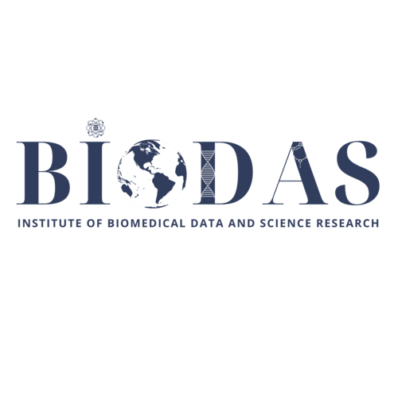
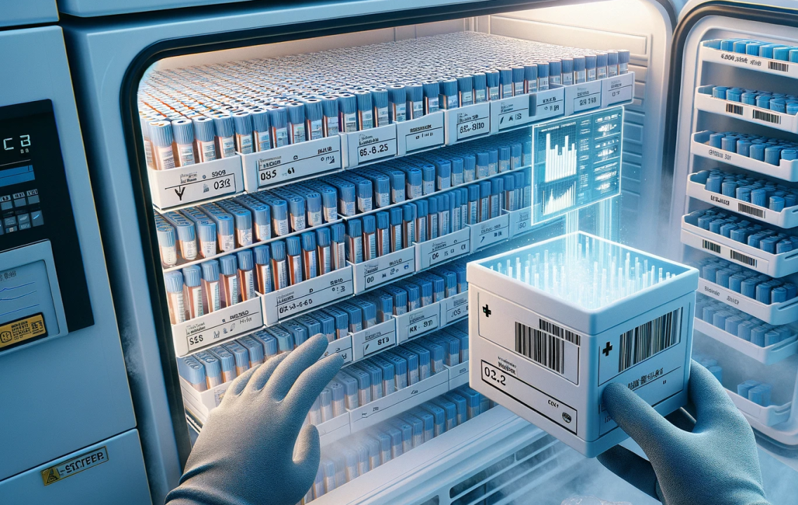
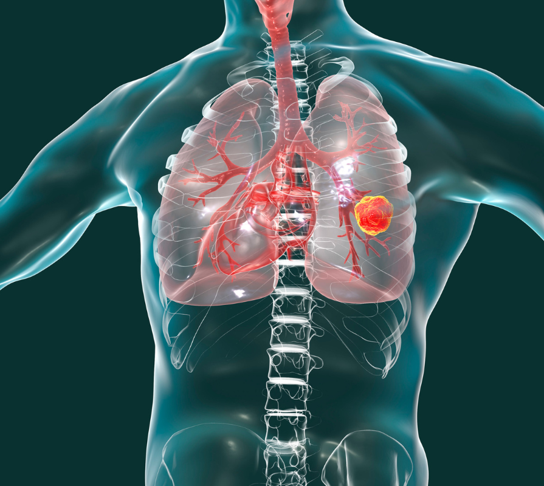

# Chào mừng đến với BIODAS

{fig-align="center"}

Trang web này là nguồn tài nguyên về nghiên cứu y sinh học và khoa học dữ liệu tại Việt Nam. BIODAS được thành lập với sứ mệnh kết nối bệnh viện, viện nghiên cứu và doanh nghiệp, nhằm thúc đẩy nghiên cứu y học và nâng cao chất lượng điều trị cho bệnh nhân. Tại đây, bạn sẽ tìm thấy thông tin về ngân hàng mẫu sinh học, cơ sở dữ liệu lâm sàng chuẩn hóa, cùng các dự án phân tích dữ liệu tiên tiến. Hãy cùng chúng tôi khám phá, kết nối và phát triển vì sức khỏe cộng đồng!

***

# Hoạt động nổi bật

{fig-align="center"}

## Cơ sở lý luận
- Biobank không chỉ là bộ sưu tập mẫu sinh học và dữ liệu mà còn là hạ tầng quan trọng cho giám sát y tế công cộng.  
- Hiện nay biobank chủ yếu tập trung ở các nước phát triển, trong khi gánh nặng bệnh tật lại cao hơn ở các quốc gia thu nhập thấp và trung bình (LMIC).  
- Gần 80% nghiên cứu y tế toàn cầu được thực hiện tại các nước giàu, nhiều nghiên cứu trong số đó lại liên quan đến bệnh phổ biến ở nước nghèo.  
- WHO đã thành lập mạng lưới **WHO/IARC BCnet** để hỗ trợ xây dựng biobank tại LMIC.  
- Tăng trưởng kinh tế và thay đổi mô hình bệnh viện công ở LMIC tạo ra nhu cầu hạ tầng nghiên cứu như biobank.  
- ASEAN đã có tăng trưởng mạnh, hệ thống bảo hiểm y tế mở rộng, tiến bộ nghiên cứu và COVID-19 càng thúc đẩy nhu cầu biobank.  
- Nghiên cứu khả thi đầu tiên tại ASEAN (Philippines, 2021) đã phát triển công cụ đánh giá và có thể nhân rộng sang các nước khác.  
- Việt Nam tăng trưởng nhanh, nhu cầu hạ tầng nghiên cứu cao → cần nghiên cứu khả thi riêng để đánh giá năng lực, tối ưu công cụ, và chuẩn bị cho xây dựng biobank.  

## Đánh giá hạ tầng và nguồn lực địa phương
- Hạ tầng: Việt Nam có thể gặp thách thức về điện, kho lạnh, kết nối Internet. Nghiên cứu khả thi giúp đánh giá hiện trạng, xác định khoảng trống, và nhu cầu cần bổ sung.
- Nhân lực: Cần đội ngũ có kỹ năng chuyên môn về thu thập, lưu trữ mẫu, quản lý dữ liệu, và tuân thủ chuẩn mực đạo đức. Nghiên cứu đánh giá mức độ sẵn có và nhu cầu đào tạo thêm.
- Nguồn lực tài chính: Biobank đòi hỏi đầu tư lớn và duy trì lâu dài. Cần xem xét nguồn tài chính trong nước và quốc tế.

## Khung pháp lý và đạo đức
- Đánh giá hệ thống pháp luật hiện tại, xác định khoảng trống và đề xuất biện pháp đảm bảo tuân thủ chuẩn mực quốc gia và quốc tế.
- Quy trình đồng thuận tham gia (informed consent) và bảo mật thông tin phải được đảm bảo phù hợp văn hóa và pháp lý địa phương.
- Xác định và huy động các bên liên quan.

## Tính bền vững và khả năng duy trì dài hạn
- Biobank tiêu tốn nhiều kinh phí, trong khi hầu hết quỹ hiện tại là dự án ngắn hạn.
- Nghiên cứu cần đưa ra kế hoạch kinh doanh để đảm bảo tính bền vững, bao gồm phân tích chi phí chi tiết, nguồn quỹ nội địa và quốc tế, và chiến lược duy trì lâu dài.

## Nhu cầu y tế công cộng, lâm sàng, tiềm năng nghiên cứu và giáo dục
- Việt Nam có gánh nặng bệnh tật cao: bệnh truyền nhiễm (lao, viêm gan) và bệnh không lây nhiễm (ung thư, tiểu đường). Biobank có thể hỗ trợ nghiên cứu và gắn với ưu tiên y tế quốc gia.
- Đánh giá năng lực nghiên cứu hiện tại (tiền lâm sàng, dịch chuyển, lâm sàng) và tiềm năng hợp tác quốc tế.
- Xác định nhu cầu đào tạo và nâng cao năng lực cho các bên liên quan.

## Quan hệ đối tác và hợp tác
- Cần hợp tác giữa các viện/trường trong nước và tổ chức quốc tế.
- Đánh giá mức độ ủng hộ của chính phủ, Bộ Y tế và các tổ chức chủ chốt.
- Xem xét khả năng lập văn phòng điều phối mạng lưới biobank Việt Nam.

## Tác động kinh tế - xã hội
- Thực hiện phân tích chi phí – lợi ích (cost-benefit analysis).
- Biobank có thể góp phần cải thiện sức khỏe cộng đồng, thúc đẩy nghiên cứu khoa học, và thu hút hợp tác quốc tế.

## Yếu tố văn hóa và xã hội
- Việt Nam có bối cảnh văn hóa đa dạng; cần lưu ý cách cộng đồng nhìn nhận việc thu thập và sử dụng mẫu sinh học.
- Nghiên cứu khả thi sẽ đánh giá các yếu tố này, đồng thời đưa ra chiến lược gắn kết cộng đồng, cán bộ y tế và nhà hoạch định chính sách.

## Kết quả kỳ vọng
- Dữ liệu từ nghiên cứu khả thi sẽ được tổng hợp thành white paper (sách trắng) mô tả hiện trạng hạ tầng biobank tại Việt Nam và nhu cầu cộng đồng liên quan.
- Đây là bước quan trọng để đảm bảo việc xây dựng biobank tại Việt Nam là khả thi, phù hợp văn hóa – xã hội, đúng chuẩn mực đạo đức, và bền vững về tài chính.

***

# Nghiên cứu/ Dự án

## Nghiên cứu Khảo sát thực trạng ứng dụng y tế điện tử (E-Health) và trí tuệ nhân tạo (AI) tại các đơn vị y tế thuộc Chương trình Chống lao Quốc gia

{fig-align="center"}

### Tổng quan
- Nghiên cứu nhằm đánh giá mức độ ứng dụng E-Health và AI trong các cơ sở y tế tham gia Chương trình Chống lao Quốc gia.
- Tập trung vào khảo sát hạ tầng CNTT, nhân lực, quy trình chuyên môn và sự sẵn sàng tiếp nhận công nghệ mới.
- Kết quả khảo sát giúp xác định thực trạng, thuận lợi, khó khăn và đề xuất giải pháp tăng cường ứng dụng công nghệ trong chẩn đoán, quản lý và điều trị lao.

### Một số nội dung khảo sát chính
- Hạ tầng kỹ thuật: tình trạng trang thiết bị CNTT, kết nối mạng, hệ thống lưu trữ và chia sẻ dữ liệu.
- Ứng dụng E-Health: hệ thống quản lý bệnh nhân lao, hồ sơ y tế điện tử, phần mềm giám sát và báo cáo dịch tễ.
- Ứng dụng AI: các công cụ hỗ trợ chẩn đoán hình ảnh (X-quang phổi), phân tích dữ liệu bệnh án, dự báo nguy cơ lây nhiễm.
- Nguồn nhân lực: mức độ đào tạo, năng lực tiếp cận công nghệ của cán bộ y tế.
- Khung pháp lý – đạo đức: chính sách hỗ trợ, vấn đề bảo mật, quyền riêng tư dữ liệu bệnh nhân.

### Kết quả kỳ vọng
- Phần lớn cơ sở đã ứng dụng một số công cụ E-Health trong quản lý bệnh nhân và báo cáo, nhưng mức độ chưa đồng đều giữa các tuyến.
- Ứng dụng AI mới ở giai đoạn thử nghiệm, tập trung chủ yếu vào chẩn đoán hình ảnh.
- Nhân lực CNTT còn hạn chế, cần đào tạo bổ sung.
- Kết quả nghiên cứu cung cấp căn cứ để đề xuất lộ trình phát triển E-Health và AI trong phòng chống lao, hướng tới nâng cao hiệu quả điều trị và kiểm soát dịch bệnh.

## Nghiên cứu Xây dựng cơ sở và phân tích dữ liệu sinh học – lâm sàng chuẩn hóa cho bệnh nhân ung thư phổi không tế bào nhỏ tại Việt Nam

{fig-align="center"}

### Tổng quan
- Nghiên cứu tập trung xây dựng cơ sở dữ liệu sinh học – lâm sàng chuẩn hóa dành cho bệnh nhân ung thư phổi không tế bào nhỏ tại Việt Nam.
- Thu thập, quản lý và phân tích dữ liệu mẫu sinh học (mô bệnh học, DNA, RNA, protein) kết hợp với dữ liệu lâm sàng (chẩn đoán, điều trị, kết quả).
- Mục tiêu nhằm tạo nền tảng dữ liệu tin cậy phục vụ nghiên cứu khoa học, thử nghiệm lâm sàng và phát triển phương pháp chẩn đoán, điều trị cá thể hóa.

### Một số nội dung chính
- Thu thập và chuẩn hóa dữ liệu: thiết kế bộ tiêu chuẩn chung cho dữ liệu sinh học và lâm sàng theo chuẩn quốc tế.
- Xây dựng hệ thống cơ sở dữ liệu: tích hợp dữ liệu đa nguồn, đảm bảo tính bảo mật và khả năng truy cập cho nghiên cứu.
- Phân tích dữ liệu: ứng dụng công cụ tin sinh học, thống kê và trí tuệ nhân tạo để tìm mối liên quan giữa đặc điểm sinh học và kết quả điều trị.
- Ứng dụng thực tiễn: hỗ trợ nghiên cứu dịch tễ, phát triển biomarker, lựa chọn phác đồ điều trị tối ưu cho bệnh nhân NSCLC tại Việt Nam.

### Kết quả dự kiến
- Tạo nguồn dữ liệu chuẩn hóa đầu tiên về NSCLC tại Việt Nam.
- Góp phần thu hẹp khoảng trống dữ liệu giữa Việt Nam và các nước phát triển.
- Hỗ trợ cá thể hóa điều trị ung thư, nâng cao chất lượng chăm sóc bệnh nhân.
- Cung cấp nền tảng cho hợp tác quốc tế, thử nghiệm lâm sàng và phát triển thuốc mới.

***

# Tin tức gần nhất

Updating...

***